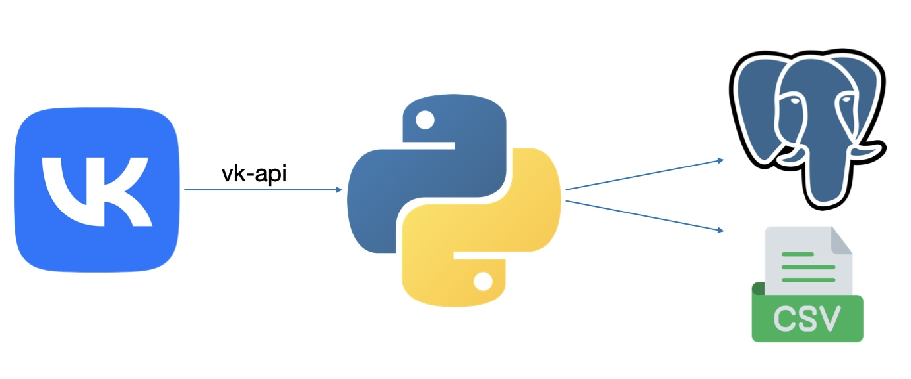
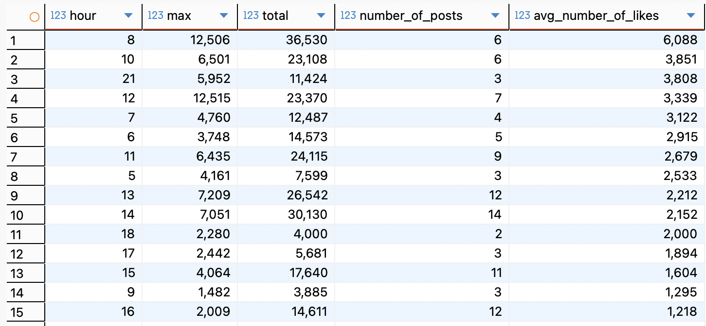
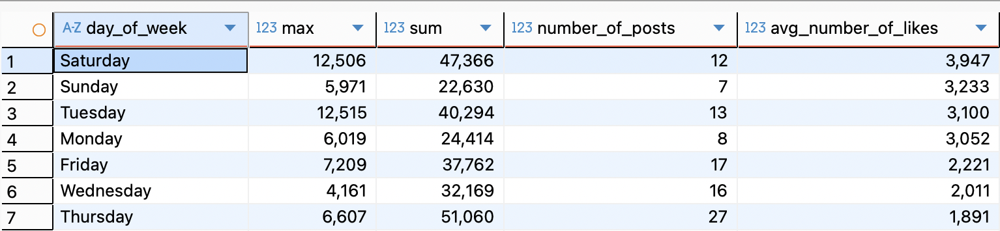
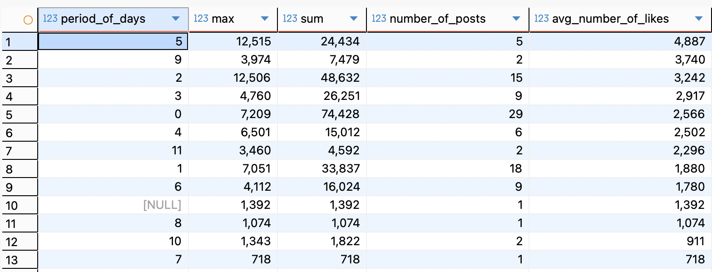
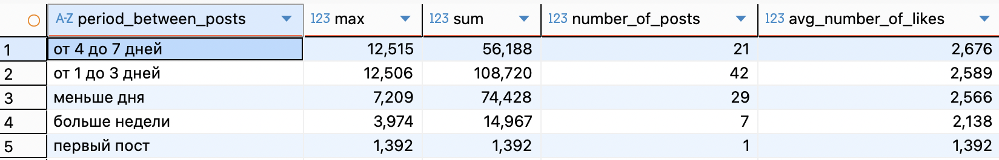
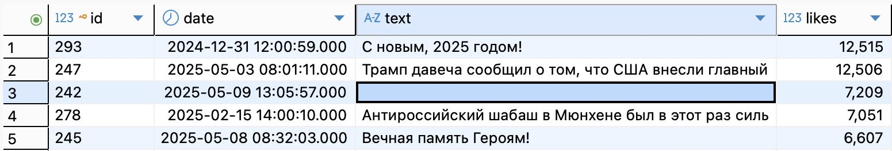

# VK page analysis

Анализируем от чего зависит количество лайков на постах в социальной сети ВКонтакте.

Анализируемая страница: https://vk.com/dm

### Параметры 

- Время публикации
- День недели публикации
- Промежуток времени между предыдущей и новой публикациями

### Архитектура



### Стек

- Python 3.12
- Модуль vk-api для python3
- Модуль Pandas для создания датафрейма и обработки данных
- PostgreSQL для анализа данных
- Docker для развертывания СУБД PostgreSQL
- Модуль psycopg2 для загруки данных в PostgreSQL

### Схема данных

``` sql
CREATE TABLE IF NOT EXISTS table1 (
                	id SERIAL PRIMARY KEY,
                	date TIMESTAMP,
                	text VARCHAR(50),
                	likes INTEGER
            	);
```

### Схема запросов

1. Зависимость от времени суток

``` sql
SELECT EXTRACT(hour from date) AS hour, 
		MAX(likes), 
		SUM(likes) AS total,
		COUNT(likes) AS number_of_posts,
		ROUND(AVG(likes)) AS avg_number_of_likes
FROM table1
GROUP BY EXTRACT(hour from date)
ORDER BY avg_number_of_likes DESC;
```
2. Зависимость от дня недели

``` sql
SELECT TO_CHAR(date, 'Day') AS day_of_week,
		MAX(likes), 
		SUM(likes),
		COUNT(likes) as number_of_posts,
		ROUND(AVG(likes)) AS avg_number_of_likes
FROM table1
GROUP BY TO_CHAR(date, 'Day')
ORDER BY avg_number_of_likes DESC;
```
3. Зависимость от промежутка времени между постами

``` sql
SELECT MAX(likes), 
		SUM(likes),
		COUNT(likes) AS number_of_posts,
		ROUND(AVG(likes)) AS avg_number_of_likes,
		period_days_table.period_of_days AS period_of_days
FROM table1 JOIN (SELECT date, EXTRACT(day from date - LAG(date, 1) OVER(order by  date asc)) AS period_of_days
					FROM table1) AS period_days_table USING(date)
GROUP BY period_days_table.period_of_days
ORDER BY avg_number_of_likes DESC;
```

### Результаты

1. Зависимость от времени суток



2. Зависимость от дня недели



3. Зависимость от промежутка времени между постами



### Анализ результатов

Самые залайканные посты оказались те, которые были опубликованы с 8:00 до 9:00 утра. Это легко объясняется тем, что эти посты в ленте у пользователей находятся первее, чем вечерние посты. У этих постов наблюдается сильный отрыв в количестве лайков от второго места - посты опубликованные в 10 утра. У вторго, третьего и четвертого места среднее количество лайков примерно одинаковое: 3851, 3808 и 3339 соответсвенно, у первого места этот показалеть равен 6088. 

Анализ по дням недели показал, что посты опубликованные в субботу и воскресенье имеют больше лайков, чем в будние дни. 

Нет явной зависимости от времени между опубликованными постами. На первом месте идут посты, промежуток времени между которыми составил 5 дней, при том, что посты промежуток между которыми составил 4 и 6 дней находятся в середине списка. 

Разобьем по группам: 



Нет явной зависимости между промежутком времени и количеством лайков.

Также рассмотрим 5 самых популярных постов: 



Самые популярными оказались посты связанные с праздничными дни или с социально острыми темами.


### Вывод

Количество лайков сильно зависит от времени публикации и дня недели. 

 
